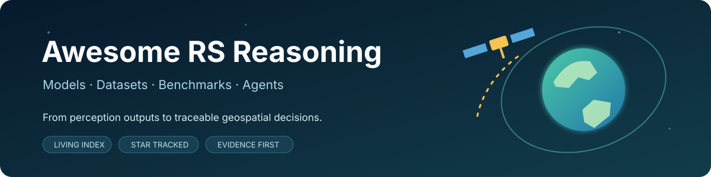
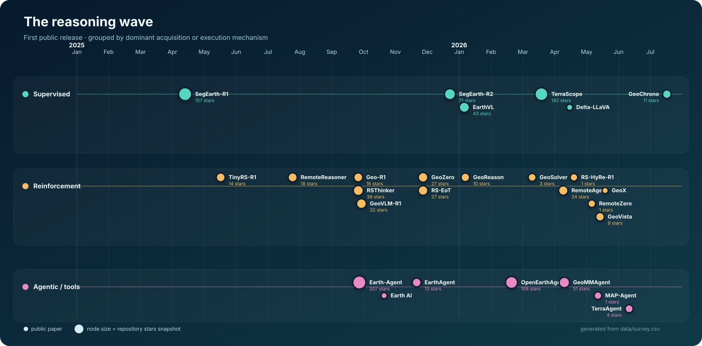

<p align="center">
  
</p>

<p align="center">
  <a href="https://awesome.re"></a>
  <a href="https://ml4sustain.github.io/Awesome-RS-Reasoning-Models/"></a>
  <a href="https://github.com/ML4Sustain/Awsome-RS-Reasoning-Models/actions"></a>
  <a href="CONTRIBUTING.md"></a>
  <a href="LICENSE-DATA"></a>
  <a href="https://www.preprints.org/frontend/manuscript/046ed51d5cc524d60bc9281a57caf963/download_pub"></a>
  
</p>

## Contents

- [1. Definition and scope of RS-Reasoning](#1-definition-and-scope)
  - [Definition and inclusion criteria](#definition-and-inclusion-criteria)
  - [Resource overview](#resource-overview)
  - [Development timeline](#development-timeline)
- [2. Taxonomy of RS-Reasoning methods](#2-taxonomy-of-rs-reasoning-methods)
- [3. Remote sensing vision-language foundations](#3-remote-sensing-vision-language-foundations)
- [4. Multimodal datasets and benchmarks](#4-multimodal-datasets-and-benchmarks)
- [5. Repository scope and maintenance](#5-repository-scope-and-maintenance)
- [6. Contributing](#6-contributing)
- [7. Citation](#7-citation)

<a id="1-definition-and-scope"></a>
## 1. Definition and scope of RS-Reasoning

Remote sensing is moving from recognizing **what is where** to establishing **why a conclusion follows from evidence**. This independent index tracks that transition across models, datasets, benchmarks, and executable agents.

> **RS-Reasoning** is task-dependent, multi-step inference that combines Earth observation evidence with geographic, temporal, or domain constraints and exposes an auditable support structure.

Entries link directly to their original paper and verified official code. Repository popularity is stored as a dated snapshot in this repository, never inferred from a transient live badge.

Read the complete survey: **[From Perception to Reasoning in Remote Sensing: A Survey and Outlook](https://www.preprints.org/frontend/manuscript/046ed51d5cc524d60bc9281a57caf963/download_pub)** ([Preprints.org](https://www.preprints.org/)).

<a id="definition-and-inclusion-criteria"></a>
### Definition and inclusion criteria

| 01 · Supervised | 02 · Reinforcement | 03 · Agentic / tool-augmented |
| --- | --- | --- |
| Learns from rationales, traces, masks, or structured intermediate supervision. | Optimizes answer, grounding, consistency, or process rewards. | Plans and executes tools, retrieval, GIS operations, or multi-step workflows. |
| **Observe:** answer + trace | **Observe:** reward + evidence | **Observe:** action + trajectory |

The tracks sit on top of enabling datasets and vision-language models, and support four application clusters from the survey:

`urban & social space` · `disaster assessment` · `environmental monitoring` · `spatiotemporal QA`

<a id="resource-overview"></a>
### Resource overview

<!-- AUTO_DASHBOARD_START -->

| Methods & models | Reasoning systems | Data & benchmarks | Official repositories | Model weights | ModelScope mirrors |
| :---: | :---: | :---: | :---: | :---: | :---: |
| **80** | **27** | **49** | **65** | **44** | **11** |

Repository Stars are stored snapshots refreshed daily by GitHub Actions. Last refresh: **2026-09-04**.

<!-- AUTO_DASHBOARD_END -->

<a id="development-timeline"></a>
### Development timeline

<details open>
<summary><b>Representative work by first public release</b></summary>

<p align="center"></p>

</details>

<a id="2-taxonomy-of-rs-reasoning-methods"></a>
## 2. Taxonomy of RS-Reasoning methods

These works satisfy the repository's operational reasoning criteria: evidence is composed across steps, intermediate claims or actions are traceable, and evaluation extends beyond final-answer accuracy. Following Table V of the survey, the three paradigms are **non-exclusive** and indicate the dominant acquisition or execution mechanism. The core taxonomy contains 27 systems, sorted by stored GitHub Stars inside each paradigm; the development timeline above uses the same method set.

<!-- AUTO_CATALOG_START -->

<details open>
<summary><b>Reasoning Models › Supervised Reasoning</b> · 6 resources</summary>

| Resource | Year / Venue | Paper | Weights / Data | Official code | Stars |
| :---: | :---: | :---: | :---: | :---: | :---: |
| **SegEarth-R1** | 2025 · arXiv | <a href="https://arxiv.org/abs/2504.09644"></a> | <a href="https://huggingface.co/earth-insights/SegEarth-R1-EarthReason"></a> · <a href="https://modelscope.cn/models/earth-insights/SegEarth-R1-EarthReason"></a> | <a href="https://github.com/earth-insights/SegEarth-R1"></a> | <a href="https://github.com/earth-insights/SegEarth-R1/stargazers"></a> |
| **TerraScope** | 2026 · CVPR | <a href="https://arxiv.org/abs/2603.19039"></a> | <a href="https://huggingface.co/sy1998/TerraScope"></a> · <a href="https://modelscope.cn/models/shuyanshuyan/terrascope"></a> | <a href="https://github.com/shuyansy/Earth-Observation-VLMs"></a> | <a href="https://github.com/shuyansy/Earth-Observation-VLMs/stargazers"></a> |
| **SegEarth-R2** | 2025 · arXiv | <a href="https://arxiv.org/abs/2512.20013"></a> | — | <a href="https://github.com/earth-insights/SegEarth-R2"></a> | <a href="https://github.com/earth-insights/SegEarth-R2/stargazers"></a> |
| **EarthVL** | 2026 · arXiv | <a href="https://arxiv.org/abs/2601.02783"></a> | — | <a href="https://github.com/Junjue-Wang/EarthVL"></a> | <a href="https://github.com/Junjue-Wang/EarthVL/stargazers"></a> |
| **GeoChrono** | 2026 · arXiv | <a href="https://arxiv.org/abs/2607.15768"></a> | <a href="https://huggingface.co/Davidup1/GeoChrono"></a> · <a href="https://modelscope.cn/models/Davidup1/GeoChrono"></a> | <a href="https://github.com/IntelliSensing/GeoChrono"></a> | <a href="https://github.com/IntelliSensing/GeoChrono/stargazers"></a> |
| **Delta-LLaVA** | 2026 · arXiv | <a href="https://arxiv.org/abs/2604.14044"></a> | — | — | — |

</details>

<details open>
<summary><b>Reasoning Models › RL-Driven Reasoning</b> · 14 resources</summary>

| Resource | Year / Venue | Paper | Weights / Data | Official code | Stars |
| :---: | :---: | :---: | :---: | :---: | :---: |
| **RSThinker** | 2026 · ICLR | <a href="https://arxiv.org/abs/2509.22221"></a> | <a href="https://huggingface.co/minglanga/RSThinker"></a> | <a href="https://github.com/minglangL/RSThinker"></a> | <a href="https://github.com/minglangL/RSThinker/stargazers"></a> |
| **GeoVLM-R1** | 2025 · arXiv | <a href="https://arxiv.org/abs/2509.25026"></a> | — | <a href="https://github.com/mustansarfiaz/GeoVLM-R1-Toolkit"></a> | <a href="https://github.com/mustansarfiaz/GeoVLM-R1-Toolkit/stargazers"></a> |
| **RS-EoT** | 2026 · CVPR | <a href="https://arxiv.org/abs/2511.22396"></a> | <a href="https://huggingface.co/ShaoRun/RS-EoT-7B"></a> · <a href="https://geox-lab.github.io/Asking_like_Socrates/"></a> | <a href="https://github.com/GeoX-Lab/Asking_like_Socrates"></a> | <a href="https://github.com/GeoX-Lab/Asking_like_Socrates/stargazers"></a> |
| **GeoZero** | 2025 · arXiv | <a href="https://arxiv.org/abs/2511.22645"></a> | <a href="https://huggingface.co/hjvsl/GeoZero"></a> · <a href="https://pan.baidu.com/s/1nJjBwO4UlVv4GFl60gjM3w?pwd=15gn"></a> | <a href="https://github.com/MiliLab/GeoZero"></a> | <a href="https://github.com/MiliLab/GeoZero/stargazers"></a> |
| **RemoteAgent** | 2026 · TGRS | <a href="https://arxiv.org/abs/2604.07765"></a> | — | <a href="https://github.com/1e12Leon/RemoteAgent"></a> | <a href="https://github.com/1e12Leon/RemoteAgent/stargazers"></a> |
| **RemoteReasoner** | 2026 · AAAI | <a href="https://doi.org/10.1609/aaai.v40i14.38175"></a> | <a href="https://huggingface.co/1e12Leon/RemoteReasoner"></a> · <a href="https://modelscope.cn/models/AIMGroup/RemoteReasoner"></a> | <a href="https://github.com/1e12Leon/RemoteReasoner"></a> | <a href="https://github.com/1e12Leon/RemoteReasoner/stargazers"></a> |
| **Geo-R1** | 2025 · arXiv | <a href="https://arxiv.org/abs/2509.21976"></a> | <a href="https://huggingface.co/Geo-R1"></a> | <a href="https://github.com/Geo-R1/geo-r1"></a> | <a href="https://github.com/Geo-R1/geo-r1/stargazers"></a> |
| **TinyRS-R1** | 2025 · arXiv | <a href="https://arxiv.org/abs/2505.12099"></a> | <a href="https://huggingface.co/aybora/Qwen2-VL-TinyRS-R1"></a> | <a href="https://github.com/aybora/TinyRS"></a> | <a href="https://github.com/aybora/TinyRS/stargazers"></a> |
| **GeoReason** | 2026 · arXiv | <a href="https://arxiv.org/abs/2601.04118"></a> | <a href="https://huggingface.co/WenshuaiLi/GeoReason"></a> | <a href="https://github.com/canlanqianyan/GeoReason"></a> | <a href="https://github.com/canlanqianyan/GeoReason/stargazers"></a> |
| **GeoVista** | 2026 · arXiv | <a href="https://arxiv.org/abs/2605.14475"></a> | <a href="https://huggingface.co/ryan6073/GeoVista-7B-Instruct"></a> · <a href="https://huggingface.co/ryan6073/GeoVista-7B-Preview"></a> | <a href="https://github.com/ryan6073/GeoVista"></a> | <a href="https://github.com/ryan6073/GeoVista/stargazers"></a> |
| **GeoSolver** | 2026 · arXiv | <a href="https://arxiv.org/abs/2603.09551"></a> | <a href="https://huggingface.co/minglanga/GeoSolver"></a> | <a href="https://github.com/minglangL/GeoSolver"></a> | <a href="https://github.com/minglangL/GeoSolver/stargazers"></a> |
| **RemoteZero** | 2026 · arXiv | <a href="https://arxiv.org/abs/2605.04451"></a> | — | <a href="https://github.com/1e12Leon/RemoteZero"></a> | <a href="https://github.com/1e12Leon/RemoteZero/stargazers"></a> |
| **RS-HyRe-R1** | 2026 · arXiv | <a href="https://arxiv.org/abs/2604.17504"></a> | <a href="https://huggingface.co/geozgz/RS-HyRe-R1"></a> | <a href="https://github.com/GeoX-Lab/RS-HyRe-R1"></a> | <a href="https://github.com/GeoX-Lab/RS-HyRe-R1/stargazers"></a> |
| **GeoX** | 2026 · arXiv | <a href="https://arxiv.org/abs/2605.20006"></a> | — | — | — |

</details>

<details open>
<summary><b>Reasoning Models › Agentic / Tool-Augmented Reasoning</b> · 7 resources</summary>

| Resource | Year / Venue | Paper | Weights / Data | Official code | Stars |
| :---: | :---: | :---: | :---: | :---: | :---: |
| **Earth-Agent** | 2026 · ICLR | <a href="https://arxiv.org/abs/2509.23141"></a> | — | <a href="https://github.com/opendatalab/Earth-Agent"></a> | <a href="https://github.com/opendatalab/Earth-Agent/stargazers"></a> |
| **OpenEarthAgent** | 2026 · ECCV | <a href="https://arxiv.org/abs/2602.17665"></a> | <a href="https://huggingface.co/MBZUAI/OpenEarthAgent"></a> · <a href="https://modelscope.cn/models/MBZUAI/OpenEarthAgent"></a> | <a href="https://github.com/mbzuai-oryx/OpenEarthAgent"></a> | <a href="https://github.com/mbzuai-oryx/OpenEarthAgent/stargazers"></a> |
| **GeoMMAgent** | 2026 · CVPR | <a href="https://arxiv.org/abs/2604.08896"></a> | — | <a href="https://github.com/Shihao-Cheng/GeoMMAgent"></a> | <a href="https://github.com/Shihao-Cheng/GeoMMAgent/stargazers"></a> |
| **EarthAgent** | 2025 · arXiv | <a href="https://arxiv.org/abs/2511.17198"></a> | — | <a href="https://github.com/earth-insights/EarthAgent"></a> | <a href="https://github.com/earth-insights/EarthAgent/stargazers"></a> |
| **TerraAgent** | 2026 · arXiv | <a href="https://arxiv.org/abs/2606.13148"></a> | — | <a href="https://github.com/Takerdat23/TerraBench"></a> | <a href="https://github.com/Takerdat23/TerraBench/stargazers"></a> |
| **MAP-Agent** | 2026 · arXiv | <a href="https://arxiv.org/abs/2605.12237"></a> | — | <a href="https://github.com/MiliLab/UHR-Micro"></a> | <a href="https://github.com/MiliLab/UHR-Micro/stargazers"></a> |
| **Earth AI** | 2025 · arXiv | <a href="https://arxiv.org/abs/2510.18318"></a> | — | — | — |

</details>

<!-- AUTO_CATALOG_END -->

<a id="3-remote-sensing-vision-language-foundations"></a>
## 3. Remote sensing vision-language foundations

Reasoning is built on perception and remote-sensing vision-language modeling. This section therefore tracks 53 **reasoning-enabling** resources separately from reasoning-specific systems: contrastive alignment models, generative and task-specific VLMs, ultra-high-resolution interfaces, retrieval, detection, segmentation, and data generation. Inclusion here indicates foundational relevance, not demonstrated multi-step reasoning.

<!-- AUTO_ECOSYSTEM_START -->

<details open>
<summary><b>Remote Sensing Vision-Language Modeling › Contrastive VLMs</b> · 7 resources</summary>

| Resource | Year / Venue | Paper | Weights / Data | Official code | Stars |
| :---: | :---: | :---: | :---: | :---: | :---: |
| **RemoteCLIP** | 2024 · TGRS | <a href="https://doi.org/10.1109/TGRS.2024.3390838"></a> | <a href="https://huggingface.co/chendelong/RemoteCLIP"></a> | <a href="https://github.com/ChenDelong1999/RemoteCLIP"></a> | <a href="https://github.com/ChenDelong1999/RemoteCLIP/stargazers"></a> |
| **SatCLIP** | 2025 · AAAI | <a href="https://doi.org/10.1609/aaai.v39i4.32457"></a> | <a href="https://huggingface.co/microsoft/SatCLIP-ViT16-L40"></a> · <a href="https://modelscope.cn/models/microsoft/SatCLIP-ViT16-L40"></a> | <a href="https://github.com/microsoft/satclip"></a> | <a href="https://github.com/microsoft/satclip/stargazers"></a> |
| **GeoRSCLIP** | 2024 · TGRS | <a href="https://doi.org/10.1109/TGRS.2024.3449154"></a> | <a href="https://huggingface.co/Zilun/GeoRSCLIP"></a> | <a href="https://github.com/om-ai-lab/RS5M"></a> | <a href="https://github.com/om-ai-lab/RS5M/stargazers"></a> |
| **DGTRS-CLIP** | 2025 · arXiv | <a href="https://arxiv.org/abs/2503.19311"></a> | <a href="https://huggingface.co/MitsuiChen14/DGTRS-CLIP-ViT-L-14"></a> · <a href="https://huggingface.co/MitsuiChen14/DGTRS-CLIP-ViT-B-16"></a> | <a href="https://github.com/MitsuiChen14/DGTRS"></a> | <a href="https://github.com/MitsuiChen14/DGTRS/stargazers"></a> |
| **PriorCLIP** | 2023 · MM | <a href="https://doi.org/10.1145/3581783.3612587"></a> | <a href="https://pan.baidu.com/s/1urfZ_64DFRelAQz-LYkcCQ?pwd=2v3v"></a> | <a href="https://github.com/jaychempan/PriorCLIP"></a> | <a href="https://github.com/jaychempan/PriorCLIP/stargazers"></a> |
| **TimeSenCLIP** | 2026 · ISPRS J. P&RS | <a href="https://doi.org/10.1016/j.isprsjprs.2026.03.043"></a> | <a href="https://huggingface.co/pallavijainpj/TimeSenCLIP"></a> | — | — |
| **GeoAlignCLIP** | 2026 · arXiv | <a href="https://arxiv.org/abs/2603.09566"></a> | — | — | — |

</details>

<details open>
<summary><b>Remote Sensing Vision-Language Modeling › Generative Large VLMs</b> · 14 resources</summary>

| Resource | Year / Venue | Paper | Weights / Data | Official code | Stars |
| :---: | :---: | :---: | :---: | :---: | :---: |
| **GeoChat** | 2024 · CVPR | <a href="https://arxiv.org/abs/2311.15826"></a> | <a href="https://huggingface.co/MBZUAI/geochat-7B"></a> · <a href="https://modelscope.cn/models/MBZUAI/geochat-7B"></a> | <a href="https://github.com/mbzuai-oryx/GeoChat"></a> | <a href="https://github.com/mbzuai-oryx/GeoChat/stargazers"></a> |
| **Falcon** | 2025 · arXiv | <a href="https://arxiv.org/abs/2503.11070"></a> | <a href="https://huggingface.co/TianHuiLab/Falcon-Single-Instruction-Large"></a> | <a href="https://github.com/TianHuiLab/Falcon"></a> | <a href="https://github.com/TianHuiLab/Falcon/stargazers"></a> |
| **LHRS-Bot** | 2024 · ECCV | <a href="https://arxiv.org/abs/2402.02544"></a> | <a href="https://drive.google.com/drive/folders/1dzWTE1k935MjMVnfLtTJiIqw7yCj-e3m?usp=drive_link"></a> · <a href="https://pan.baidu.com/s/1n1h_ZImeKTgvoNHjr5bq3Q?pwd=qhqw"></a> | <a href="https://github.com/NJU-LHRS/LHRS-Bot"></a> | <a href="https://github.com/NJU-LHRS/LHRS-Bot/stargazers"></a> |
| **EarthGPT** | 2024 · TGRS | <a href="https://arxiv.org/abs/2401.16822"></a> | — | <a href="https://github.com/wivizhang/EarthGPT"></a> | <a href="https://github.com/wivizhang/EarthGPT/stargazers"></a> |
| **TEOChat** | 2025 · ICLR | <a href="https://arxiv.org/abs/2410.06234"></a> | <a href="https://huggingface.co/jirvin16/TEOChat"></a> | <a href="https://github.com/ermongroup/TEOChat"></a> | <a href="https://github.com/ermongroup/TEOChat/stargazers"></a> |
| **RSGPT** | 2025 · ISPRS | <a href="https://arxiv.org/abs/2307.15266"></a> | — | <a href="https://github.com/Lavender105/RSGPT"></a> | <a href="https://github.com/Lavender105/RSGPT/stargazers"></a> |
| **SkySenseGPT** | 2024 · arXiv | <a href="https://arxiv.org/abs/2406.10100"></a> | <a href="https://huggingface.co/ll-13/SkySenseGPT-7B-CLIP-ViT"></a> | <a href="https://github.com/Luo-Z13/SkySense-Chat"></a> | <a href="https://github.com/Luo-Z13/SkySense-Chat/stargazers"></a> |
| **SkyEyeGPT** | 2025 · ISPRS | <a href="https://arxiv.org/abs/2401.09712"></a> | <a href="https://huggingface.co/ZhanYang-nwpu/SkyEyeGPT"></a> | <a href="https://github.com/ZhanYang-nwpu/SkyEyeGPT"></a> | <a href="https://github.com/ZhanYang-nwpu/SkyEyeGPT/stargazers"></a> |
| **RSUniVLM** | 2024 · arXiv | <a href="https://arxiv.org/abs/2412.05679"></a> | <a href="https://drive.google.com/drive/folders/1TtaoOPmh167gpgHHWRNBMCaA7t_XZ4Vg?usp=sharing"></a> | <a href="https://github.com/xuliu-cyber/RSUniVLM"></a> | <a href="https://github.com/xuliu-cyber/RSUniVLM/stargazers"></a> |
| **EarthMarker** | 2024 · TGRS | <a href="https://ieeexplore.ieee.org/document/10817639"></a> | — | <a href="https://github.com/wivizhang/EarthMarker"></a> | <a href="https://github.com/wivizhang/EarthMarker/stargazers"></a> |
| **FUSAR-GPT** | 2026 · CVPR | <a href="https://arxiv.org/abs/2602.19190"></a> | — | <a href="https://github.com/yangyifremad/FUSAR-KLIP"></a> | <a href="https://github.com/yangyifremad/FUSAR-KLIP/stargazers"></a> |
| **Earth-OneVision** | 2026 · arXiv | <a href="https://arxiv.org/abs/2606.10819"></a> | — | — | — |
| **SkyNative** | 2026 · arXiv | <a href="https://arxiv.org/abs/2605.17949"></a> | — | — | — |
| **RingMoGPT** | 2024 · TGRS | — | — | — | — |

</details>

<details open>
<summary><b>Remote Sensing Vision-Language Modeling › Task-Specific VLMs</b> · 15 resources</summary>

| Resource | Year / Venue | Paper | Weights / Data | Official code | Stars |
| :---: | :---: | :---: | :---: | :---: | :---: |
| **LAE-DINO** | 2025 · AAAI | <a href="https://arxiv.org/abs/2408.09110"></a> | <a href="https://huggingface.co/ML4Sustain/LAE-DINO"></a> · <a href="https://modelscope.cn/models/ML4Sustain/LAE-DINO"></a> | <a href="https://github.com/jaychempan/LAE-DINO"></a> | <a href="https://github.com/jaychempan/LAE-DINO/stargazers"></a> |
| **RemoteSAM** | 2025 · MM | <a href="https://arxiv.org/abs/2505.18022"></a> | <a href="https://huggingface.co/1e12Leon/RemoteSAM"></a> | <a href="https://github.com/1e12Leon/RemoteSAM"></a> | <a href="https://github.com/1e12Leon/RemoteSAM/stargazers"></a> |
| **EarthMind** | 2025 · arXiv | <a href="https://arxiv.org/abs/2506.01667"></a> | <a href="https://huggingface.co/sy1998/EarthMind-4B"></a> | <a href="https://github.com/shuyansy/Earth-Observation-VLMs"></a> | <a href="https://github.com/shuyansy/Earth-Observation-VLMs/stargazers"></a> |
| **InstructSAM** | 2025 · NeurIPS | <a href="https://arxiv.org/abs/2505.15818"></a> | — | <a href="https://github.com/VoyagerXvoyagerx/InstructSAM"></a> | <a href="https://github.com/VoyagerXvoyagerx/InstructSAM/stargazers"></a> |
| **GeoGround** | 2024 · arXiv | <a href="https://arxiv.org/abs/2411.11904"></a> | <a href="https://huggingface.co/erenzhou/GeoGround"></a> · <a href="https://modelscope.cn/models/zytx121/geoground"></a> | <a href="https://github.com/VisionXLab/GeoGround"></a> | <a href="https://github.com/VisionXLab/GeoGround/stargazers"></a> |
| **CastDet** | 2024 · ECCV | <a href="https://arxiv.org/abs/2311.11646"></a> | — | <a href="https://github.com/VisionXLab/CastDet"></a> | <a href="https://github.com/VisionXLab/CastDet/stargazers"></a> |
| **GeoPix** | 2025 · GRSM | <a href="https://doi.org/10.1109/MGRS.2025.3560293"></a> | <a href="https://huggingface.co/Norman-Ou/GeoPix"></a> | <a href="https://github.com/Norman-Ou/GeoPix"></a> | <a href="https://github.com/Norman-Ou/GeoPix/stargazers"></a> |
| **UniGeoSeg** | 2026 · CVPR | <a href="https://arxiv.org/abs/2511.23332"></a> | <a href="https://huggingface.co/nishuo1999/UniGeoSeg"></a> | <a href="https://github.com/MiliLab/UniGeoSeg"></a> | <a href="https://github.com/MiliLab/UniGeoSeg/stargazers"></a> |
| **OpenRSD** | 2025 · ICCV | <a href="https://arxiv.org/abs/2503.06146"></a> | <a href="https://pan.baidu.com/s/1sV3GHgneC3dQskIaYABefg?pwd=aan9"></a> | <a href="https://github.com/floatingstarZ/OpenRSD"></a> | <a href="https://github.com/floatingstarZ/OpenRSD/stargazers"></a> |
| **RSVG-ZeroOV** | 2026 · AAAI | <a href="https://arxiv.org/abs/2509.18711"></a> | — | <a href="https://github.com/like413/RSVG-ZeroOV"></a> | <a href="https://github.com/like413/RSVG-ZeroOV/stargazers"></a> |
| **LLaMA-Unidetector** | 2025 · TGRS | <a href="https://doi.org/10.1109/TGRS.2025.3564332"></a> | <a href="https://drive.google.com/file/d/1AwUn5EebmmLBo7njjW_Ng1q9zDrqkNbB/view"></a> · <a href="https://pan.baidu.com/s/1P3pW3euqqxYVZQvw-is1vQ?pwd=1234"></a> | <a href="https://github.com/ChloeeGrace/LLaMA-Unidetector"></a> | <a href="https://github.com/ChloeeGrace/LLaMA-Unidetector/stargazers"></a> |
| **REO-VLM** | 2024 · arXiv | <a href="https://arxiv.org/abs/2412.15115"></a> | — | <a href="https://github.com/REO-VLM-anonymous/REO-VLM"></a> | <a href="https://github.com/REO-VLM-anonymous/REO-VLM/stargazers"></a> |
| **Cross-View OVD** | 2025 · arXiv | <a href="https://arxiv.org/abs/2510.03858"></a> | — | — | — |
| **FASE** | 2025 · CIKM | <a href="https://doi.org/10.1145/3746252.3760838"></a> | — | — | — |
| **GeoMag** | 2025 · MM | <a href="https://arxiv.org/abs/2507.05887"></a> | — | — | — |

</details>

<details open>
<summary><b>Reasoning-Enabling Models › Ultra-High-Resolution VLMs</b> · 3 resources</summary>

| Resource | Year / Venue | Paper | Weights / Data | Official code | Stars |
| :---: | :---: | :---: | :---: | :---: | :---: |
| **GeoLLaVA-8K** | 2025 · NeurIPS | <a href="https://arxiv.org/abs/2505.21375"></a> | <a href="https://huggingface.co/initiacms/GeoLLaVA-8K"></a> | <a href="https://github.com/MiliLab/GeoLLaVA-8K"></a> | <a href="https://github.com/MiliLab/GeoLLaVA-8K/stargazers"></a> |
| **ZoomEarth** | 2026 · CVPR | <a href="https://arxiv.org/abs/2511.12267"></a> | <a href="https://huggingface.co/HappyBug/ZoomEarth-3B"></a> | <a href="https://github.com/earth-insights/ZoomEarth"></a> | <a href="https://github.com/earth-insights/ZoomEarth/stargazers"></a> |
| **Zoom-RS (Look Where It Matters)** | 2025 · arXiv | <a href="https://arxiv.org/abs/2511.20460"></a> | — | <a href="https://github.com/kiki-zyq/ZoomSearch"></a> | <a href="https://github.com/kiki-zyq/ZoomSearch/stargazers"></a> |

</details>

<details open>
<summary><b>Reasoning-Enabling Models › Generation Models</b> · 2 resources</summary>

| Resource | Year / Venue | Paper | Weights / Data | Official code | Stars |
| :---: | :---: | :---: | :---: | :---: | :---: |
| **Text2Earth** | 2025 · GRSM | <a href="https://ieeexplore.ieee.org/document/10988859"></a> | <a href="https://huggingface.co/lcybuaa/Text2Earth"></a> · <a href="https://modelscope.cn/models/lcybuaa1111/Text2Earth"></a> | <a href="https://github.com/Chen-Yang-Liu/Text2Earth"></a> | <a href="https://github.com/Chen-Yang-Liu/Text2Earth/stargazers"></a> |
| **Earthsynth** | 2025 · arXiv | <a href="https://arxiv.org/abs/2505.12108"></a> | <a href="https://huggingface.co/jaychempan/EarthSynth"></a> · <a href="https://modelscope.cn/models/ML4Sustain/EarthSynth"></a> | <a href="https://github.com/jaychempan/EarthSynth"></a> | <a href="https://github.com/jaychempan/EarthSynth/stargazers"></a> |

</details>

<details open>
<summary><b>Perception Foundations › Object Detection</b> · 6 resources</summary>

| Resource | Year / Venue | Paper | Weights / Data | Official code | Stars |
| :---: | :---: | :---: | :---: | :---: | :---: |
| **CalNet** | 2023 · MM | — | <a href="https://pan.baidu.com/s/1PnmdKqIxPnTgK6yQ6WfwpA"></a> | <a href="https://github.com/hexiao0275/CALNet-Dronevehicle"></a> | <a href="https://github.com/hexiao0275/CALNet-Dronevehicle/stargazers"></a> |
| **Enhance-then-Search (AugSearch)** | 2025 · CVPR | <a href="https://arxiv.org/abs/2504.04517"></a> | <a href="https://pan.baidu.com/s/17wECMZ7X-wkFMXSCQ_SvAw?pwd=ttue"></a> | <a href="https://github.com/jaychempan/ETS"></a> | <a href="https://github.com/jaychempan/ETS/stargazers"></a> |
| **S2A-Det** | 2023 · TGRS | — | — | <a href="https://github.com/hexiao0275/S2ADet"></a> | <a href="https://github.com/hexiao0275/S2ADet/stargazers"></a> |
| **LCMA** | 2026 · Electronics | — | — | <a href="https://github.com/hexiao0275/LCMA_RGBT"></a> | <a href="https://github.com/hexiao0275/LCMA_RGBT/stargazers"></a> |
| **SDCM** | 2025 · TMM | — | — | — | — |
| **Semantic-Aware Ship Detection** | 2025 · IGARSS | <a href="https://arxiv.org/abs/2508.15930"></a> | — | — | — |

</details>

<details open>
<summary><b>Perception Foundations › Semantic Segmentation</b> · 2 resources</summary>

| Resource | Year / Venue | Paper | Weights / Data | Official code | Stars |
| :---: | :---: | :---: | :---: | :---: | :---: |
| **Rethinking Transformers (RS Segmentation)** | 2023 · TGRS | <a href="https://doi.org/10.1109/TGRS.2023.3302024"></a> | <a href="https://drive.google.com/file/d/1yV070cXTrkCN2FTHKM2DIXI_dtVjaTJ6/view"></a> | <a href="https://github.com/lyhnsn/GLOTS"></a> | <a href="https://github.com/lyhnsn/GLOTS/stargazers"></a> |
| **Multilevel Multimodal Fusion Transformer** | 2024 · TGRS | <a href="https://doi.org/10.1109/TGRS.2024.3373033"></a> | — | <a href="https://github.com/yida12345/FTransUNet"></a> | <a href="https://github.com/yida12345/FTransUNet/stargazers"></a> |

</details>

<details open>
<summary><b>Perception Foundations › Data Augmentation</b> · 1 resource</summary>

| Resource | Year / Venue | Paper | Weights / Data | Official code | Stars |
| :---: | :---: | :---: | :---: | :---: | :---: |
| **Diverse Instance Generation (Diffusion)** | 2025 · GRSL | <a href="https://arxiv.org/abs/2511.18031"></a> | — | — | — |

</details>

<details open>
<summary><b>Perception Foundations › Cross-Modal Retrieval</b> · 3 resources</summary>

| Resource | Year / Venue | Paper | Weights / Data | Official code | Stars |
| :---: | :---: | :---: | :---: | :---: | :---: |
| **SAN (Scene-aware Aggregation)** | 2023 · ICMR | <a href="https://doi.org/10.1145/3591106.3592236"></a> | <a href="https://pan.baidu.com/s/1qDSdcvm6as2rKmAmC_86VA?pwd=86a2"></a> | <a href="https://github.com/jaychempan/SWAN"></a> | <a href="https://github.com/jaychempan/SWAN/stargazers"></a> |
| **PiR (Prior Instruction Representation)** | 2024 · arXiv | <a href="https://arxiv.org/abs/2405.10160"></a> | <a href="https://pan.baidu.com/s/1urfZ_64DFRelAQz-LYkcCQ?pwd=2v3v"></a> | <a href="https://github.com/jaychempan/PriorCLIP"></a> | <a href="https://github.com/jaychempan/PriorCLIP/stargazers"></a> |
| **DOVE (Direction-Oriented Embedding)** | 2024 · TGRS | <a href="https://doi.org/10.1109/TGRS.2024.3392779"></a> | — | — | — |

</details>

<!-- AUTO_ECOSYSTEM_END -->

<a id="4-multimodal-datasets-and-benchmarks"></a>
## 4. Multimodal datasets and benchmarks

Following the paper's distinction, **general-purpose multimodal datasets** provide supervision for representation learning and transfer, while **task-oriented benchmarks** define capability-specific inputs, outputs, and evaluation protocols. The table keeps both resource types searchable without treating dataset scale as evidence of reasoning quality.

<!-- AUTO_DATASETS_START -->

| Resource | Year / Type | Purpose | Access |
| :---: | :---: | :---: | :---: |
| **Delta-QA**<br><sub>with Delta-LLaVA</sub> | 2026 · Change-QA benchmark | Bi-temporal visual question answering | <a href="https://arxiv.org/abs/2604.14044"></a> |
| **DisasterInsight**<br><sub>with Disaster-response VLMs</sub> | 2026 · Benchmark | Disaster scene reasoning | <a href="https://arxiv.org/abs/2601.18493"></a> |
| **EarthVLSet**<br><sub>with EarthVL</sub> | 2026 · Dataset + benchmark | Earth vision-language understanding | <a href="https://huggingface.co/datasets/Kingdrone-Junjue/EarthVLSet"></a> |
| **GTPBD-MM**<br><sub>with Reasoning VLMs</sub> | 2026 · Multimodal benchmark | Terraced parcel and boundary understanding | <a href="https://arxiv.org/abs/2604.12315"></a> |
| **GeoChrono-Data**<br><sub>with GeoChrono</sub> | 2026 · Benchmark + instruction | Long-term temporal understanding | <a href="https://huggingface.co/datasets/Davidup1/GeoChrono-Data"></a> |
| **GeoHeight-Bench**<br><sub>with GeoHeightChat</sub> | 2026 · Reasoning benchmark | Height-aware multimodal reasoning | <a href="https://arxiv.org/abs/2603.25565"></a> |
| **GeoMMBench**<br><sub>with GeoMMAgent</sub> | 2026 · Multimodal benchmark | Geoscience and remote-sensing multimodal understanding | <a href="https://arxiv.org/abs/2604.08896"></a> |
| **GeoReason-Bench**<br><sub>with GeoReason</sub> | 2026 · Reasoning benchmark | Logical consistency reasoning | <a href="https://huggingface.co/datasets/WenshuaiLi/GeoReason-Bench"></a> |
| **GeoSeg-Bench**<br><sub>with UniGeoSeg</sub> | 2026 · Segmentation benchmark | Open-world geospatial segmentation | <a href="https://huggingface.co/datasets/nishuo1999/GeoSeg-Bench"></a> |
| **GroundSet**<br><sub>with Grounding VLMs</sub> | 2026 · Grounding benchmark | Cadastral-grounded spatial understanding | <a href="https://arxiv.org/abs/2603.14609"></a> |
| **HM-Bench**<br><sub>with Reasoning VLMs</sub> | 2026 · Reasoning benchmark | Hyperspectral multimodal reasoning | <a href="https://arxiv.org/abs/2604.08884"></a> |
| **ME-RSRG**<br><sub>with EAR</sub> | 2026 · Reasoning-grounding benchmark | Multi-entity reasoning and grounding | <a href="https://github.com/CV-ShuchangLyu/ME-RSRG"></a> |
| **MMRS-OneVision**<br><sub>with Earth-OneVision</sub> | 2026 · Instruction dataset | Multi-sensor and multi-task instruction tuning | <a href="https://arxiv.org/abs/2606.10819"></a> |
| **NeSy-Route**<br><sub>with GeoSolver</sub> | 2026 · Neuro-symbolic benchmark | Constrained route planning | <a href="https://arxiv.org/abs/2603.16307"></a> |
| **OmniEarth**<br><sub>with Remote-sensing VLMs</sub> | 2026 · Multimodal benchmark | Multi-task Earth observation evaluation | <a href="https://arxiv.org/abs/2603.09471"></a> |
| **RSFG-100k**<br><sub>with GeoAlignCLIP</sub> | 2026 · Alignment dataset | Fine-grained region-text alignment | <a href="https://arxiv.org/abs/2603.09566"></a> |
| **RSME-Bench**<br><sub>with SkyNative</sub> | 2026 · Reasoning benchmark | Multi-entity remote-sensing reasoning | <a href="https://arxiv.org/abs/2605.17949"></a> |
| **RSRCC**<br><sub>with Change-reasoning models</sub> | 2026 · Change-reasoning benchmark | Reasoning over bi-temporal change | <a href="https://arxiv.org/abs/2604.20623"></a> |
| **TerraBench**<br><sub>with TerraAgent</sub> | 2026 · Agent benchmark | Executable Earth-data workflows | <a href="https://arxiv.org/abs/2606.13148"></a> |
| **UHR-CoZ**<br><sub>with GeoEyes</sub> | 2026 · Ultra-high-resolution benchmark | Active zooming and compositional reasoning | <a href="https://github.com/nanocm/GeoEyes"></a> |
| **UHR-Micro**<br><sub>with MAP-Agent</sub> | 2026 · Ultra-high-resolution benchmark | Small-object perception and reasoning | <a href="https://arxiv.org/abs/2605.12237"></a> |
| **VLRS-Bench**<br><sub>with Remote-sensing VLMs</sub> | 2026 · Vision-language benchmark | Comprehensive vision-language reasoning | <a href="https://arxiv.org/abs/2602.07045"></a> |
| **DisasterM3**<br><sub>with Disaster-response VLMs</sub> | 2025 · Dataset + benchmark | Multimodal multi-hazard understanding | <a href="https://arxiv.org/abs/2505.21089"></a> |
| **EarthReason**<br><sub>with SegEarth-R1</sub> | 2025 · Dataset + benchmark | Geospatial pixel reasoning | <a href="https://huggingface.co/datasets/earth-insights/EarthReason"></a> |
| **FINERS-4k**<br><sub>with FineRS (FINERS)</sub> | 2025 · Reasoning-segmentation dataset | Fine-grained small-object reasoning and segmentation | <a href="https://iiau-zhanglu.github.io/FINERS/"></a> |
| **GAIA**<br><sub>with General-purpose VLMs</sub> | 2025 · Instruction dataset | Geospatial instruction alignment | <a href="https://arxiv.org/abs/2502.09598"></a> |
| **Git-10M**<br><sub>with Text2Earth</sub> | 2025 · Pretraining dataset | Global text-to-Earth generation | <a href="https://huggingface.co/datasets/lcybuaa/Git-10M"></a> |
| **KnowFlow-Bench**<br><sub>with CangLing-KnowFlow</sub> | 2025 · Agent benchmark | Workflow generation and execution | <a href="https://cangling-agent.github.io/KnowFlow/"></a> |
| **LAE-1M**<br><sub>with LAE-DINO</sub> | 2025 · Pretraining dataset | Language-aware object detection | <a href="https://huggingface.co/datasets/ML4Sustain/LAE-1M"></a> |
| **LaSeRS**<br><sub>with SegEarth-R2</sub> | 2025 · Reasoning benchmark | Complex-instruction segmentation | <a href="https://huggingface.co/datasets/earth-insights/LaSeRS"></a> |
| **Landsat30-AU**<br><sub>with General-purpose VLMs</sub> | 2025 · Multimodal dataset | Global Landsat image-text understanding | <a href="https://arxiv.org/abs/2508.03127"></a> |
| **RemoteSAM270k**<br><sub>with RemoteSAM</sub> | 2025 · Instruction dataset | Segmentation and recognition | <a href="https://huggingface.co/datasets/1e12Leon/RemoteSAM270k"></a> |
| **SAR-TEXT**<br><sub>with SAR VLMs</sub> | 2025 · Image-text dataset | SAR image-language alignment | <a href="https://arxiv.org/abs/2507.18743"></a> |
| **SARLANG-1M**<br><sub>with SAR VLMs</sub> | 2025 · Pretraining dataset | Million-scale SAR-language pretraining | <a href="https://arxiv.org/abs/2504.03254"></a> |
| **TEOChatlas**<br><sub>with TEOChat</sub> | 2025 · Temporal dataset | Temporal Earth observation dialogue | <a href="https://huggingface.co/datasets/jirvin16/TEOChatlas"></a> |
| **BigEarthNet-MM**<br><sub>with General-purpose VLMs</sub> | 2024 · Multimodal pretraining dataset | Multispectral image-text representation | <a href="https://arxiv.org/abs/2404.07043"></a> |
| **BigEarthNet.txt**<br><sub>with General-purpose VLMs</sub> | 2024 · Caption dataset | Multilingual Earth-observation descriptions | <a href="https://arxiv.org/abs/2603.29630"></a> |
| **ChatEarthNet**<br><sub>with ChatEarthNet</sub> | 2024 · Instruction dataset | Earth-observation dialogue and instruction tuning | <a href="https://arxiv.org/abs/2402.11325"></a> |
| **FIT-RS**<br><sub>with SkySenseGPT</sub> | 2024 · Instruction dataset | Fine-grained remote-sensing tasks | <a href="https://huggingface.co/datasets/ll-13/FIT-RS"></a> |
| **GeoChat-Instruct**<br><sub>with GeoChat</sub> | 2024 · Instruction dataset | Grounded remote-sensing dialogue | <a href="https://huggingface.co/datasets/MBZUAI/GeoChat_Instruct"></a> |
| **LuoJiaHOG**<br><sub>with General-purpose VLMs</sub> | 2024 · Multimodal dataset | Remote-sensing vision-language understanding | <a href="https://arxiv.org/abs/2403.10887"></a> |
| **REO-Instruct**<br><sub>with REO-VLM</sub> | 2024 · Instruction dataset | Continuous Earth-observation regression | <a href="https://github.com/REO-VLM-anonymous/REO-VLM"></a> |
| **RS5M**<br><sub>with GeoRSCLIP</sub> | 2024 · Pretraining dataset | Remote-sensing image-text alignment | <a href="https://huggingface.co/datasets/omlab/RS5M"></a> |
| **SkyEye-968k**<br><sub>with SkyEyeGPT</sub> | 2024 · Instruction dataset | Multi-task remote-sensing instruction | <a href="https://huggingface.co/datasets/ZhanYang-nwpu/SkyEye-968k"></a> |
| **SkyScript**<br><sub>with RemoteCLIP</sub> | 2024 · Pretraining dataset | Large-scale image-text alignment | <a href="https://arxiv.org/abs/2312.11029"></a> |
| **VRSBench**<br><sub>with General-purpose VLMs</sub> | 2024 · Dataset + benchmark | Captioning VQA and grounding | <a href="https://github.com/lzw-lzw/VRSBench"></a> |
| **refGeo**<br><sub>with GeoGround</sub> | 2024 · Grounding dataset | Multi-format visual grounding | <a href="https://huggingface.co/datasets/erenzhou/refGeo"></a> |
| **RSICap**<br><sub>with RSGPT</sub> | 2023 · Caption dataset | Remote-sensing image captioning | <a href="https://arxiv.org/abs/2307.15266"></a> |
| **SECOND-CC**<br><sub>with Change-captioning models</sub> | 2023 · Change-caption dataset | Semantic change description | <a href="https://github.com/Chen-Yang-Liu/RSICC"></a> |

<!-- AUTO_DATASETS_END -->

<a id="5-repository-scope-and-maintenance"></a>
## 5. Repository scope and maintenance

### Inclusion boundary

A reasoning-specific work should demonstrate:

1. **Composition** — a conclusion combines multiple evidence items or inference steps.
2. **Traceability** — claims or actions link to observations, constraints, or tool outputs.
3. **Process-aware evaluation** — evaluation probes grounding, consistency, calibration, or execution beyond final-answer accuracy.

Perception, semantic alignment, generation, or grounding work remains valuable, but is labeled as an enabling foundation unless it meets these criteria.

### Reproduce and update the index

```bash
python -m pip install -r requirements.txt

# Add or edit a resource
$EDITOR data/survey.csv

# Fill missing scholarly metadata
python scripts/fetch_arxiv_meta.py

# Store current GitHub Stars and forks
python scripts/fetch_github_metrics.py

# Render derived files
python scripts/build_readme.py
python scripts/plot_timeline.py
```

- `data/survey.csv` stores paper metadata and official repository URLs.
- `data/github_metrics.json` stores dated Star/fork snapshots.
- `data/ecosystem.csv` stores the extended 90-resource model and hosting audit.
- `data/ecosystem_github_stars.json` stores its dated official-repository Star snapshot.
- `data/datasets.csv` stores standalone dataset and benchmark releases.
- README sections between `AUTO_*` markers are generated; editorial sections stay untouched.
- GitHub Actions verifies generated files and refreshes popularity snapshots on a schedule.

<a id="6-contributing"></a>
## 6. Contributing

Corrections and new resources are welcome. Follow [CONTRIBUTING.md](CONTRIBUTING.md), edit [data/survey.csv](data/survey.csv), or open a **Resource submission** issue.

Please include the official code URL and describe what evidence, trace, or tool trajectory makes the work reasoning-specific. Unknown fields should stay empty rather than being guessed.

<a id="7-citation"></a>
## 7. Citation

If this collection supports your research, please cite both the survey that defines the taxonomy and this repository when you use the continuously maintained resource metadata.

### Survey paper

> Jiancheng Pan, Liang Yao, Zilun Zhang, Yijie Zheng, Jiahao Li, Xiao He, Wenjia Xu, Yuqian Fu, Fan Liu, Zhaojun Liu, Jianwei Yin, and Xiaomeng Huang. “From Perception to Reasoning in Remote Sensing: A Survey and Outlook.” Manuscript, 2026.

```bibtex
@article{pan2026perception,
  title   = {From Perception to Reasoning in Remote Sensing: A Survey and Outlook},
  author  = {Pan, Jiancheng and Yao, Liang and Zhang, Zilun and
             Zheng, Yijie and Li, Jiahao and He, Xiao and Xu, Wenjia and
             Fu, Yuqian and Liu, Fan and Liu, Zhaojun and Yin, Jianwei and
             Huang, Xiaomeng},
  year    = {2026},
  note    = {Manuscript}
}
```

### Living repository

```bibtex
@misc{pan2026awesomeRSreasoning,
  title        = {Awesome Remote Sensing Reasoning: Models, Datasets, Benchmarks, and Agents},
  author       = {Pan, Jiancheng and Yao, Liang and Zhang, Zilun and
                  Zheng, Yijie and Li, Jiahao and He, Xiao and Xu, Wenjia and
                  Fu, Yuqian and Liu, Fan and Liu, Zhaojun and Yin, Jianwei and
                  Huang, Xiaomeng},
  year         = {2026},
  howpublished = {GitHub repository},
  url          = {https://github.com/ML4Sustain/Awsome-RS-Reasoning-Models},
  note         = {Living resource; accessed YYYY-MM-DD}
}
```

GitHub can also generate citation formats automatically from [CITATION.cff](CITATION.cff). Replace `YYYY-MM-DD` with your access date when citing the evolving catalog.

### Data provenance

The extended ecosystem was imported on 2026-08-24 from the public [VoyagerX/Awesome-RS-Reasoning-Models ModelScope Studio](https://modelscope.cn/studios/VoyagerX/Awesome-RS-Reasoning-Models/files), then normalized and stored locally. This repository does not require that Studio at build or runtime; later corrections and Star snapshots are maintained here.

## 8. License

Code is licensed under [MIT](LICENSE); catalog data under [CC BY 4.0](LICENSE-DATA). Linked resources retain their original licenses.

<p align="center"><sub>Maintained as an evidence-first map of reasoning over our planet.</sub></p>
