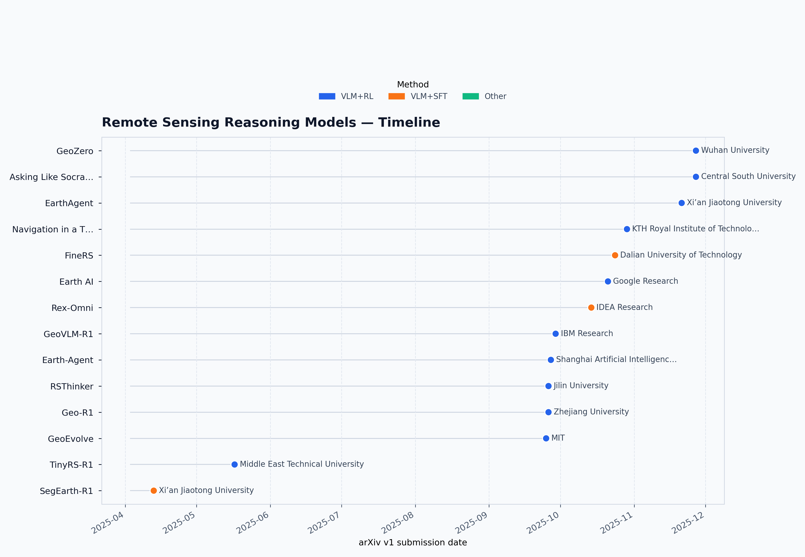

# Remote Sensing Reasoning Models Survey

  

A living survey of **RS reasoning / RSVLRM** models, continuously updated by the community.

## Timeline (auto-generated)

Latest timeline shown above (auto-built from `data/survey.csv`).

## Model List (auto-generated)

<!-- AUTO_TABLE_START -->

| arXiv v1 date   | Model          | Institution                                 | Method   | Paradigm   | arXiv                                          | Code   |
|:----------------|:---------------|:--------------------------------------------|:---------|:-----------|:-----------------------------------------------|:-------|
| 2025-11-27      |                | Central South University                    | VLM+RL   | RSVLRM     | [2511.22396](https://arxiv.org/abs/2511.22396) |        |
| 2025-11-27      | GeoZero        | Wuhan University                            | VLM+RL   | RSVLRM     | [2511.22645](https://arxiv.org/abs/2511.22645) |        |
| 2025-11-21      | EarthAgent     | Xi’an Jiaotong University                   | VLM+RL   | RSVLRM     | [2511.17198](https://arxiv.org/abs/2511.17198) |        |
| 2025-10-29      |                | KTH Royal Institute of Technology           | VLM+RL   | RSVLRM     | [2510.25679](https://arxiv.org/abs/2510.25679) |        |
| 2025-10-24      | FineRS         | Dalian University of Technology             | VLM+SFT  | RSVLRM     | [2510.21311](https://arxiv.org/abs/2510.21311) |        |
| 2025-10-21      | Earth AI       | Google Research                             | VLM+RL   | RSVLRM     | [2510.18318](https://arxiv.org/abs/2510.18318) |        |
| 2025-10-14      | Rex-Omni       | IDEA Research                               | VLM+SFT  | RSVLRM     | [2510.12798](https://arxiv.org/abs/2510.12798) |        |
| 2025-09-29      | GeoVLM-R1      | IBM Research                                | VLM+RL   | RSVLRM     | [2509.25026](https://arxiv.org/abs/2509.25026) |        |
| 2025-09-27      | Earth-Agent    | Shanghai Artificial Intelligence Laboratory | VLM+RL   | RSVLRM     | [2509.23141](https://arxiv.org/abs/2509.23141) |        |
| 2025-09-26      | Geo-R1         | Zhejiang University                         | VLM+RL   | RSVLRM     | [2509.21976](https://arxiv.org/abs/2509.21976) |        |
| 2025-09-26      | RSThinker      | Jilin University                            | VLM+RL   | RSVLRM     | [2509.22221](https://arxiv.org/abs/2509.22221) |        |
| 2025-09-25      | GeoEvolve      | MIT                                         | VLM+RL   | RSVLRM     | [2509.21593](https://arxiv.org/abs/2509.21593) |        |
| 2025-07-25      | RemoteReasoner | Hohai University                            | VLM+RL   | RSVLRM     | [2507.1928](https://arxiv.org/abs/2507.19280)  |        |
| 2025-05-17      | TinyRS-R1      | Middle East Technical University            | VLM+RL   | RSVLRM     | [2505.12099](https://arxiv.org/abs/2505.12099) |        |
| 2025-04-13      | SegEarth-R1    | Xi’an Jiaotong University                   | VLM+SFT  | RSVLRM     | [2504.09644](https://arxiv.org/abs/2504.09644) |        |

<!-- AUTO_TABLE_END -->

## How to add a new model
1. Add one row to `data/survey.csv`
2. Fill `arxiv_id` (recommended) and optionally `model`, `institution`, `method`, `paradigm`
3. Open a PR or push directly; GitHub Actions will auto-fill arXiv metadata and rebuild the table + timeline.

## License
- Code: MIT (`LICENSE`)
- Data: CC-BY 4.0 (`LICENSE-DATA`)
